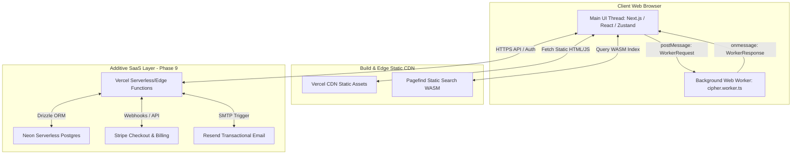
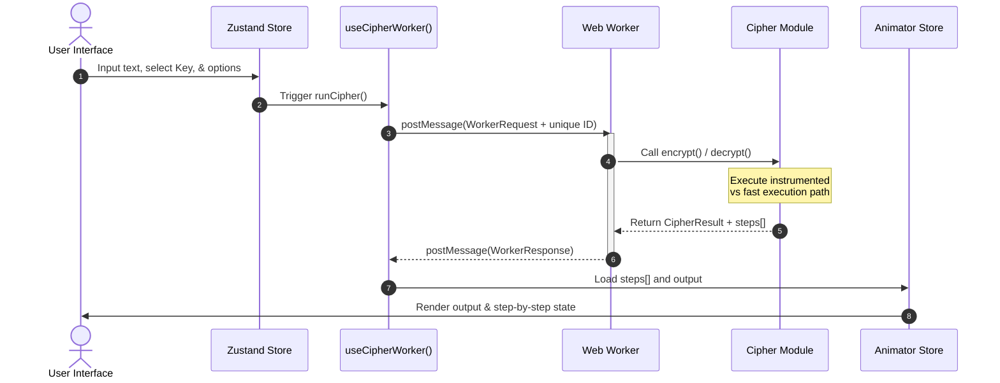

<!-- README.md -->
# CryptoViz

Interact with Cryptography, Visualised in Real-Time.


CryptoViz is a fully static Next.js 15 cybersecurity visualizer and cryptography learning platform. It allows developers, students, and security professionals to explore cryptographic algorithms step-by-step with off-thread calculations. The platform operates client-side inside secure browser Web Workers, rendering interactive visual trace state machines.

---

## 🔗 Live Demo

Visit the production site at [crypto-viz-liart.vercel.app](crypto-viz-liart.vercel.app). Explore the interactive visualizer ciphers, read built-in cybersecurity documentation, and browse our curated learning resources list.

---

## ✨ Features

### 1. Cipher Visualizer
CryptoViz supports step-by-step state animations, dynamic parameters, and off-thread execution inside Web Workers. Below is the list of supported ciphers:

| Cipher | Category | Security Status | Standard |
| :--- | :--- | :--- | :--- |
| **Caesar** | Classical | legacy | Shift cipher |
| **ROT13** | Classical | legacy | Fixed Caesar-13 |
| **Vigenère** | Classical | legacy | Polyalphabetic substitution |
| **Playfair** | Classical | legacy | 5x5 Matrix bigram cipher |
| **Rail Fence** | Classical | legacy | Transposition zigzag cipher |
| **Atbash** | Classical | legacy | Reversed alphabet |
| **XOR** | Symmetric | legacy | Byte-wise XOR stream |
| **OTP (One-Time Pad)** | Symmetric | secure (with caveats) | Perfect secrecy cipher |
| **DES** | Symmetric | deprecated | FIPS 46-3 (64-bit block) |
| **3DES** | Symmetric | deprecated | SP 800-67 (Triple DES) |
| **AES-128 / AES-256** | Symmetric | secure | FIPS 197 standard |
| **RSA-OAEP** | Asymmetric | secure | PKCS #1 v2.2 |
| **Diffie-Hellman (DH)** | Asymmetric | secure | RFC 7919 / FIPS 196 |
| **ECDSA P-256** | Asymmetric | secure | FIPS 186-5 (Elliptic Curve) |
| **SHA-256** | Hash | secure | FIPS 180-4 standard |
| **SHA-512** | Hash | secure | FIPS 180-4 standard |
| **MD5** | Hash | broken | RFC 1321 (Educational only) |
| **HMAC-SHA256** | Hash | secure | RFC 2104 standard |
| **Bcrypt** | Hash | secure | Blowfish-based KDF |

### 2. Docs Module
- **Interactive Markdown (MDX)**: Custom MDX rendering with LaTeX mathematical equations.
- **Auto-linking Ciphers**: Custom plugins that convert backtick tags directly into visualizer link pills.
- **Reading Time & TOC**: Interactive table of contents tracking read times.

### 3. Resources Module
- **Curated Reading**: High-quality resource registry mapping tools, books, videos, and specifications.
- **Client-side Filter**: Rapid filtering by tags, reading duration, and content types without backend requests.

---

## 🏛️ Architecture

### High-Level Architecture Diagram



### Project Structure

```
cryptoviz/
├── app/                  # Next.js App Router folders
│   ├── (visualizer)/     # Visualizer route group
│   ├── (docs)/           # MDX Docs route group
│   ├── (resources)/      # Resources filter list
│   ├── layout.tsx        # Top-level HTML and layouts
│   └── page.tsx          # Marketing home landing page
├── components/           # Reusable UI component blocks
│   ├── ui/               # Radix UI wrapper primitives
│   ├── cipher/           # Grid displays and step controls
│   ├── docs/             # Toc layout and MDX callouts
│   └── resources/        # Cards and tags search components
├── lib/                  # Underlying business engines
│   ├── cipher/           # Pure JS cryptographic implementations
│   ├── workers/          # Web worker entry file
│   ├── hooks/            # useCipherWorker & share URL managers
│   ├── store/            # Visualizer application stores
│   ├── mdx/              # MDX remark/rehype processors
│   ├── search/           # Pagefind index loaders
│   └── utils/            # CSS classes merging and sanitisers
├── content/              # Raw data files
│   ├── docs/             # MDX documents content
│   └── resources.ts      # Statically-typed resource database
├── public/               # Public assets and Pagefind WASM
├── tests/                # Verification suites
│   ├── unit/             # Vitest cipher verification
│   ├── e2e/              # Playwright browser flows
│   ├── a11y/             # axe-core accessibility checks
│   └── security/         # Security header tests
└── .github/workflows/    # CI/CD action routines
```

### Data Flow



1. **User input**: The user types plaintext, configures keys, and options in the visualizer UI.
2. **State dispatch**: React fields update state in the visualizer Zustand store.
3. **Worker handoff**: The `useCipherWorker()` hook captures input and creates a `WorkerRequest` payload with a unique ID, sending it via `postMessage()`.
4. **Execution**: The Web Worker (`cipher.worker.ts`) acts as a router, calling the selected cipher's `encrypt` or `decrypt` module function.
5. **Path selection**: If the UI is open, the instrumented path runs to produce `steps[]` trace data; otherwise, a fast path executes.
6. **Worker response**: The worker returns the `WorkerResponse` with the `CipherResult` object (containing `output` and `steps[]`).
7. **Animation trigger**: The hook resolves the promise, updates the Zustand state, and populates the `StepAnimator` UI component for display.

### Key Architectural Decisions

| Decision | Choice | Rationale | Trade-off |
| :--- | :--- | :--- | :--- |
| **Deployment Model** | Next.js Static Export (`output: 'export'`) | High scalability, zero hosting costs, and server-side safety under Vercel Free Tier. | No runtime Node.js middleware; requires static pre-generation. |
| **Cryptography Threading** | Browser Web Workers | Offloads math operations from the UI thread to prevent browser interface freeze. | Message serialization latency between main thread and worker. |
| **Cryptographic Primitives** | `@noble/*` Libraries | Audited, secure, dependency-free, and tree-shakeable alternative to legacy modules. | Minimal feature footprint; requires custom implementation of block modes. |
| **Static Site Search** | Pagefind WASM | Compiles a static search index at build time, executing search directly in WASM. | Requires a local build hook step to generate indexes. |
| **State Management** | Zustand | Lightweight state store with URL hash synchronization. | Manual sync needed to prevent SSR mismatches. |
| **Testing Harness** | Vitest | Extremely fast, ESM-native test runner sharing Next.js configurations. | Simulates DOM APIs via jsdom. |
| **Component System** | Radix UI Primitive wrapper | Unstyled accessible base primitives designed to be styled using Tailwind. | Requires writing custom Tailwind wrappers for each component. |

### SaaS Architecture (Additive Layer)
The SaaS layer (Phase 9) integrates seamlessly as an additive option without altering the static visualizer core:
- **Auth**: Executed on Vercel Serverless Functions utilizing `better-auth` supporting OAuth and password flows.
- **Database**: `Neon` Serverless PostgreSQL managed via `Drizzle ORM`.
- **Payments**: `Stripe Checkout` redirects and customer portal webhook synchronizations.
- **Messaging**: `Resend` APIs for transaction alerts and user confirmations.
- **Rate Limiting**: `Upstash Redis` token-bucket rate limits on edge functions.

---

## 💻 Tech Stack

| Category | Technology | Version | Purpose |
| :--- | :--- | :--- | :--- |
| **Framework** | Next.js | 15.x | Application engine and routing shell |
| **Language** | TypeScript | 5.x | Strict-type compiler correctness |
| **Styling** | Tailwind CSS | v4 | Utility-first cascading style engine |
| **UI Primitives** | Radix UI | Latest | Accessible, unstyled React base controls |
| **Animation** | Motion (Framer) | Latest | Fluid transitions and timeline animations |
| **Crypto Primitives** | `@noble/hashes` & `@noble/curves` | Latest | Standard secure hashing, HMAC, KDF, and ECDSA |
| **Native API** | WebCrypto API | Standard | Secure AES block encryption and key management |
| **State Management** | Zustand | Latest | Unified UI settings and parameter synchronization |
| **Content Render** | `next-mdx-remote` | Latest | Dynamic build-time MDX content assembly |
| **Search Engine** | Pagefind | Latest | Statically-indexed client search module |
| **Unit Testing** | Vitest | Latest | In-memory unit and mathematical tests |
| **E2E Testing** | Playwright | Latest | Browser automation verification |
| **A11y Audit** | axe-core | Latest | Automated WCAG accessibility verification |
| **CI Workflow** | GitHub Actions | Standard | Build, lint, typecheck, and validation runner |
| **Hosting Platform** | Vercel | Standard | Static edge hosting and preview deployment |
| **Auth System** | `better-auth` | Latest | Multi-provider client security manager |
| **Database Engine** | Neon Postgres | Latest | SQL server database storage |
| **ORM Wrapper** | Drizzle ORM | Latest | Type-safe SQL schema database definitions |
| **Payment Gateway** | Stripe API | Latest | User premium access control and checkouts |
| **Email Relay** | Resend | Latest | Transactional notifications and verification mail |

---

## ⚡ Getting Started

### Prerequisites

Ensure you have the following installed before launching:

| Utility | Minimum Version | Check Command |
| :--- | :--- | :--- |
| **Node.js** | 22.x LTS | `node -v` |
| **pnpm** | 9.x | `pnpm -v` |
| **Git** | Latest | `git --version` |

### Step-by-Step Setup

1. **Clone the repository**:
   ```bash
   git clone https://github.com/csxark/CryptoViz.git
   cd cryptoviz
   ```

2. **Install node dependencies**:
   ```bash
   pnpm install
   ```

3. **Configure Environment Variables** (Required for OG metadata):
   Create a `.env.local` file in the root directory:
   ```bash
   NEXT_PUBLIC_APP_URL=http://localhost:3000
   ```

4. **Launch the development server**:
   ```bash
   pnpm dev
   ```

Open `http://localhost:3000` in your web browser. You should see the CryptoViz landing page with the navigation bar and theme toggle fully functional.

---

## 🛠️ Commands Reference

| Command | Description | When to use |
| :--- | :--- | :--- |
| `pnpm dev` | Starts development server on port 3000. | Active UI coding and development. |
| `pnpm build` | Compiles source and exports static assets. | Production preparation or preview check. |
| `pnpm postbuild` | Generates Pagefind WASM indexes. | Must run after `pnpm build` finishes. |
| `pnpm lint` | Performs ESLint and Biome code verification. | Code formatting and styling check. |
| `pnpm typecheck` | Validates TypeScript files using `tsc`. | Compile safety verification. |
| `pnpm test` | Executes unit tests under Vitest. | Validating cipher correctness. |
| `pnpm test:watch` | Runs Vitest tests in watch mode. | Active development of cipher test cases. |
| `pnpm test:e2e` | Runs Playwright browser tests. | Validating overall user browser paths. |
| `pnpm test:a11y` | Executes automated axe-core audits. | Accessibility compliance checks. |
| `pnpm test:security` | Asserts security header structures. | Verifying CSP compliance in `vercel.json`. |
| `pnpm audit` | Performs vulnerability scanning. | Checking npm dependencies safety. |
| `pnpm analyze` | Triggers bundle payload analysis. | Budget validation for Javascript chunk sizes. |
| `pnpm db:push` | Syncs local schema definitions. | Updating Neon database structure (Phase 9). |
| `pnpm db:migrate` | Runs Drizzle SQL migration routines. | Applying DB migrations in production (Phase 9). |

---


## 🤝 Contributing

We welcome contributions to CryptoViz. Please read [CONTRIBUTING.md](./CONTRIBUTING.md) and [GUIDELINES.md](./GUIDELINES.md) to understand local development protocols, code structure, and pull request rules.

- **To add a new cipher**: Create a pure mathematical module, add tests, and update the Web Worker router.
- **To add a new doc**: Add a `.mdx` file to the content path with the required Zod frontmatter fields.
- **To add a resource**: Update the static resource array database with verified HTTPS URLs.

---

## 📄 License

This project is licensed under the MIT License - see the [LICENSE](./LICENSE) file for details. CryptoViz is built primarily for cybersecurity education and interactive learning purposes.

---

## 💖 Acknowledgements

- **@noble libraries**: Paulmillr's highly optimized, audited cryptographic libraries.
- **Radix UI**: Accessible primitives enabling clean Tailwind components.
- **Pagefind**: Fast, static indexing engine running inside WASM.
- **NIST & IETF**: FIPS and RFC committees for publishing test vectors.
